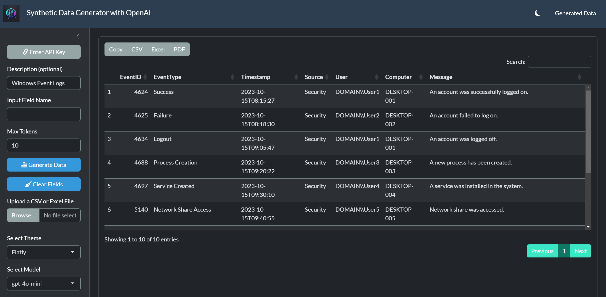

# Synthetic Data Generator with OpenAI

## Overview

The **Synthetic Data Generator with OpenAI** is a Shiny-based web application designed to generate synthetic data using OpenAI's GPT models. This tool allows users to specify fields, upload existing data files, and generate synthetic data based on their requirements. The application supports multiple themes, dark mode, and provides a user-friendly interface for data generation and manipulation.

## Features

- **OpenAI Integration**: Generate synthetic data using OpenAI's GPT models (e.g., `gpt-4o-mini`, `gpt-4o`).
- **Customizable Fields**: Define custom fields for data generation.
- **File Upload**: Upload CSV or Excel files to pre-fill fields and guide data generation.
- **Theme Selection**: Choose from a variety of Bootstrap themes to customize the app's appearance.
- **Dark Mode**: Toggle between light and dark modes for better visibility in different lighting conditions.
- **API Key Management**: Securely enter and save your OpenAI API key within the app.
- **Data Table Export**: Export generated data to CSV, Excel, or PDF formats.
- **Debug Information**: Access detailed debug information for troubleshooting API requests and responses.

## Installation

To run this application locally, you need to have R and RStudio installed. Follow these steps:

1. **Install Required Packages**:
   Open RStudio and run the following commands to install the necessary packages:

   ```R
   install.packages("shiny")
   install.packages("DT")
   install.packages("dplyr")
   install.packages("bslib")
   install.packages("bsicons")
   install.packages("httr")
   install.packages("jsonlite")
   install.packages("readxl")
   ```

2. **Download the Application Code**:
   Clone or download the repository containing the `app.R` file.

3. **Run the Application**:
   Open the `app.R` file in RStudio and click the "Run App" button to launch the application.

## Usage

1. **Enter API Key**:
   - Click the "Enter API Key" button to input your OpenAI API key.
   - Save the API key to enable data generation.

2. **Define Fields**:
   - Enter a description of the data you want to generate (optional).
   - Specify the fields for which you want to generate data. You can either type in the field names or upload a CSV/Excel file to auto-detect fields.

3. **Upload Data File (Optional)**:
   - Upload a CSV or Excel file to pre-fill the fields and guide the data generation process.

4. **Generate Data**:
   - Click the "Generate Data" button to send a request to the OpenAI API and generate synthetic data based on your specifications.

5. **View and Export Data**:
   - The generated data will be displayed in a table. You can export the data to CSV, Excel, or PDF formats using the buttons provided.

6. **Clear Fields**:
   - Use the "Clear Fields" button to reset the input fields and start over.

7. **Theme Selection**:
   - Choose a theme from the dropdown menu to customize the app's appearance.

8. **Debug Information**:
   - Access detailed debug information in the "Debug Info" section to troubleshoot any issues with API requests or data generation.

## Dependencies

- **shiny**: For building the web application.
- **DT**: For rendering interactive data tables.
- **dplyr**: For data manipulation.
- **bslib**: For Bootstrap theming and UI components.
- **bsicons**: For Bootstrap icons.
- **httr**: For making HTTP requests to the OpenAI API.
- **jsonlite**: For parsing JSON responses from the API.
- **readxl**: For reading Excel files.

## Screenshots



## License

This project is licensed under the MIT License. See the [LICENSE](LICENSE) file for details.

## Contributing

Contributions are welcome! Please open an issue or submit a pull request for any improvements or bug fixes.

## Acknowledgments

- OpenAI for providing the GPT models.
- RStudio for the Shiny framework.
- Bootstrap for the UI components and themes.

---

**Note**: This application requires an OpenAI API key to function. Make sure to keep your API key secure and do not share it publicly.
